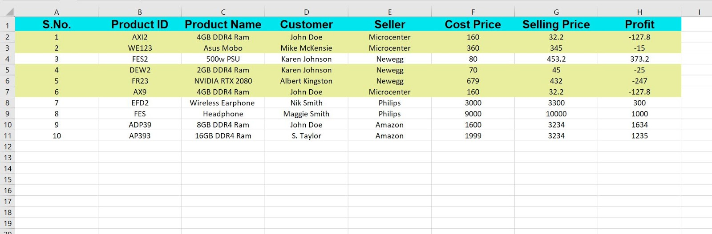

# Product Inventory Manager

It is a GUI application for desktop made using Tkinter to manage product inventory. It can create, read, update, and delete product information to and from the database. It can also export the inventory data to an excel file. 

It accepts data into the following fields, from the user:
- Product ID
- Product Name
- Customer
- Seller
- Cost Price
- Selling Price
  

It also calculates the profit and loss for each item while exporting the data to excel file. 

### Libraries Used 

- **Tkinter**
- **ttkthemes**
- **sqlite3**
- **openpyxl**
  
Screenshots and source code of the Application are provided below.

***Application Window***

***The screenshot of the excel file it creates***

